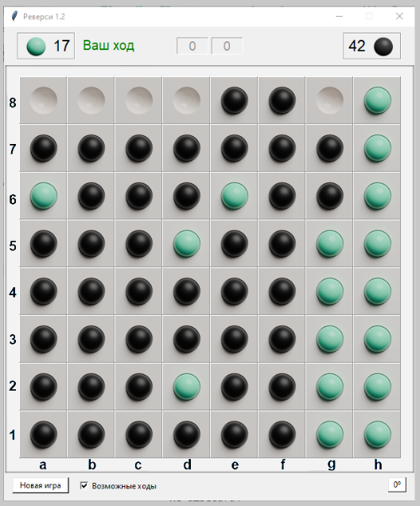

К вопросу [Есть данные полного перебора этой позиции в игре реверси. Как их использовать для поиска лучшего хода?](https://ru.stackoverflow.com/questions/1604820)



Есть данные перебора ходов до конечной позиции, в которой один из игроков выигрывает. Как использовать эти данные для поиска лучшего хода в начальной позиции?

```text
(1, 2, 0, 'пропуск', 3, 'пропуск', 6) счет (36, 28)
(1, 2, 0, 'пропуск', 6, 'пропуск', 3) счет (36, 28)
(6, 'пропуск', 1, 2, 0, 'пропуск', 3) счет (36, 28)
(6, 'пропуск', 1, 2, 3, 'пропуск', 0) счет (36, 28)
(1, 3, 0, 'пропуск', 2, 'пропуск', 6) счет (35, 29)
(1, 3, 0, 'пропуск', 6, 'пропуск', 2) счет (35, 29)
(1, 3, 6, 'пропуск', 0, 'пропуск', 2) счет (35, 29)
(6, 'пропуск', 1, 3, 0, 'пропуск', 2) счет (35, 29)
(3, 2, 6, 'пропуск', 1, 'пропуск', 0) счет (34, 30)
(2, 1, 3, 'пропуск', 0, 'пропуск', 6) счет (33, 31)
(2, 1, 3, 'пропуск', 6, 'пропуск', 0) счет (33, 31)
(6, 'пропуск', 2, 0, 3, 'пропуск', 1) счет (33, 31)
(6, 'пропуск', 2, 1, 3, 'пропуск', 0) счет (33, 31)
(6, 'пропуск', 3, 2, 1, 'пропуск', 0) счет (33, 31)
(0, 1, 3, 2, 6, 'пропуск', 'пропуск') счет (32, 32)
(3, 2, 0, 1, 6, 'пропуск', 'пропуск') счет (32, 32)
(0, 1, 2, 3, 6, 'пропуск', 'пропуск') счет (30, 34)
(1, 2, 6, 0, 3, 'пропуск', 'пропуск') счет (30, 34)
(1, 3, 6, 'пропуск', 2, 0, 'пропуск') счет (30, 34)
(2, 1, 0, 3, 6, 'пропуск', 'пропуск') счет (30, 34)
(2, 1, 6, 3, 0, 'пропуск', 'пропуск') счет (30, 34)
(2, 3, 6, 0, 1, 'пропуск', 'пропуск') счет (30, 34)
(2, 3, 6, 1, 0, 'пропуск', 'пропуск') счет (30, 34)
(6, 'пропуск', 1, 3, 2, 0, 'пропуск') счет (30, 34)
(0, 1, 6, 'пропуск', 3, 2, 'пропуск') счет (29, 35)
(6, 'пропуск', 0, 1, 3, 2, 'пропуск') счет (29, 35)
(6, 'пропуск', 3, 2, 0, 1, 'пропуск') счет (29, 35)
(2, 3, 0, 1, 6, 'пропуск', 'пропуск') счет (28, 36)
(0, 1, 6, 'пропуск', 2, 3, 'пропуск') счет (27, 37)
(1, 2, 3, 0, 6, 'пропуск', 'пропуск') счет (27, 37)
(2, 0, 6, 3, 1, 'пропуск', 'пропуск') счет (27, 37)
(3, 2, 6, 'пропуск', 0, 1, 'пропуск') счет (27, 37)
(6, 'пропуск', 0, 1, 2, 3, 'пропуск') счет (27, 37)
(6, 'пропуск', 2, 1, 0, 3, 'пропуск') счет (27, 37)
(1, 3, 2, 0, 6, 'пропуск', 'пропуск') счет (25, 39)
(2, 3, 1, 0, 6, 'пропуск', 'пропуск') счет (25, 39)
(3, 2, 1, 0, 6, 'пропуск', 'пропуск') счет (25, 39)
(6, 'пропуск', 2, 3, 1, 0, 'пропуск') счет (25, 39)
(2, 0, 3, 1, 6, 'пропуск', 'пропуск') счет (24, 40)
(6, 'пропуск', 2, 3, 0, 1, 'пропуск') счет (23, 41)
(2, 0, 1, 3, 6, 'пропуск', 'пропуск') счет (22, 42)
(6, 'пропуск', 2, 0, 1, 3, 'пропуск') счет (22, 42)
```

Решение использует алгоритм минимакс.

Нужно построить дерево `текущий ход` + `возможные продолжения` и для каждого узла в дереве дать оценку позиции.

Если ход последний, то оценка очевидна - разница между числом белых и чёрных фишек.

Если ход белых, то в качестве оценки берётся минимум оценок дочерних поддеревьев: чёрные постараются выбрать продолжение, максимизирующее число чёрных фишек в итоге.

Если ход чёрных, то белые будут разыгрывать такое продолжение, которое максимизирует белые фишки. То есть оценка равна максимуму оценки продолжения.

Чтобы найти наилучшую игру для белых, нужно выбрать первый ход с максимальной оценкой. Соответственно, черные всякий раз будут выбирать ход с минимальной оценкой.